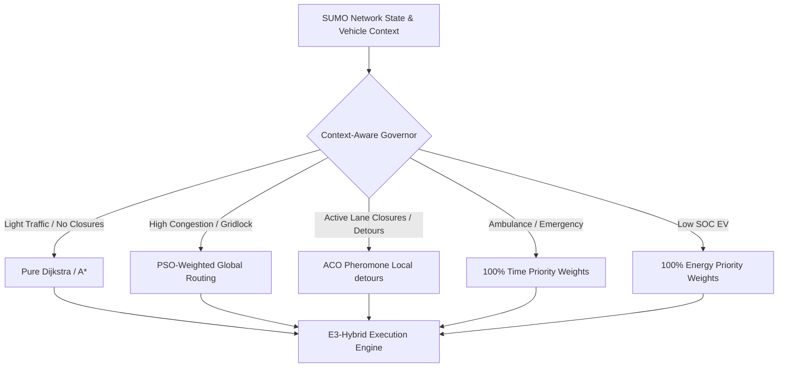

# Plain English Pseudo-code & E3-Hybrid Optimization Strategy

This document provides a clear, plain English description and pseudo-code for all routing algorithms implemented in the SUMO simulation. It also explains the scientific reasons behind their performance characteristics and provides an engineering design to make the **E3-Hybrid** framework universally superior.

---

## Part 1: Plain English Pseudo-code of the Routing Algorithms

### 1. Dijkstra's Algorithm (Shortest Path)
* **Concept:** It starts at the origin and systematically explores the nearest intersections, keeping track of the shortest cumulative travel time/distance to each intersection. It stops as soon as it reaches the destination.
* **Pseudo-code:**
  ```text
  1. Initialize a "shortest times" list, setting the time to the origin to 0, and all other intersections to infinity.
  2. Create a priority queue of intersections to visit, sorted by their current shortest time. Add the origin.
  3. While there are intersections to visit:
     a. Pick the intersection with the smallest shortest time.
     b. If this is the destination, we are done! Reconstruct the route by tracing back steps.
     c. For each connected road (neighboring intersection):
        i. Calculate the time to reach this neighbor = (shortest time to current intersection) + (travel time of the road).
        ii. If this calculated time is smaller than the neighbor's current shortest time:
            - Update the neighbor's shortest time.
            - Record that the best way to get to this neighbor is through the current intersection.
            - Add the neighbor to the priority queue.
  ```

### 2. A* (A-Star) Algorithm (Heuristically Guided Shortest Path)
* **Concept:** Similar to Dijkstra, but it uses a heuristic (such as straight-line distance to the destination) to guide the search. It prioritizes intersections that "look" closer to the destination, searching far fewer paths than Dijkstra.
* **Pseudo-code:**
  ```text
  1. Initialize "cost to reach" for the origin to 0, and all other intersections to infinity.
  2. Create a priority queue where priority = (cost to reach intersection) + (estimated straight-line distance from intersection to destination).
  3. Add the origin to the queue.
  4. While the queue is not empty:
     a. Pick the intersection with the lowest total estimated cost.
     b. If this is the destination, stop and reconstruct the route.
     c. For each connected road (neighbor):
        i. Calculate cost to neighbor = (cost to current intersection) + (travel time of the road).
        ii. If this calculated cost is smaller than the neighbor's current recorded cost:
            - Update neighbor's cost to reach.
            - Record the predecessor link.
            - Add neighbor to the priority queue with priority = (neighbor's cost to reach) + (straight-line distance to destination).
  ```

### 3. Ant Colony Optimization (ACO) Router (Local Pheromone-based Exploration)
* **Concept:** Simulates ants laying pheromones. "Ants" (virtual pathfinders) traverse the network from origin to destination, probabilistically choosing roads based on travel times and existing pheromones. Successful paths receive more pheromones, which gradually evaporate over time.
* **Pseudo-code:**
  ```text
  1. Set initial pheromone levels on all road segments to a small constant value.
  2. For each iteration:
     a. Spawn a set of virtual ants at the origin.
     b. For each ant, build a path to the destination:
        i. At each intersection, look at all connected outgoing roads.
        ii. For each road, calculate the choice probability = (pheromone level)^alpha * (1 / travel time)^beta.
        iii. Choose the next road using a probability wheel based on those scores.
        iv. Record the road and move to the next intersection until the destination is reached.
     c. Evaluate the total travel time of each ant's path.
     d. Evaporate pheromones on all roads: multiply current pheromone levels by (1 - evaporation_rate).
     e. Deposit new pheromones on roads traversed by the ants: add pheromones inversely proportional to the path's total travel time (better paths get more pheromones).
  3. Return the path with the highest pheromone density.
  ```

### 4. Bee Colony Optimization (BCO) Router (Scout and Recruit Search)
* **Concept:** Simulates honeybees. "Scout bees" explore alternative paths. They return to the hive (decision center) and perform a "waggle dance" (sharing path scores). "Employed bees" are recruited to refine the best paths, while "scout bees" look for new ones if paths don't improve.
* **Pseudo-code:**
  ```text
  1. Generate an initial set of random paths (scout paths) from origin to destination.
  2. For each iteration:
     a. Calculate the "fitness" (overall utility: combination of travel time, energy, and safety) for each path.
     b. Determine the number of bees to recruit for each path: paths with higher fitness recruit more follower bees.
     c. For each path (food source):
        i. Send recruited follower bees to perform local searches around the path (e.g., swapping a few intersections or detour segments).
        ii. If a follower bee finds a better path, replace the current path with the new one.
     d. If any path has not improved for a set number of iterations, abandon it. Send a scout bee to generate a completely new random path.
  3. Return the best path found by the colony.
  ```

### 5. Particle Swarm Optimization (PSO) Router (Global Velocity-based Search)
* **Concept:** Simulates a flock of birds. Each "particle" represents a complete path candidate. In each iteration, particles "fly" through the decision space by adjusting their path search weights towards their own personal best-remembered path and the global best path found by the entire swarm.
* **Pseudo-code:**
  ```text
  1. Initialize a swarm of particles, where each particle is assigned a path and a personal weight vector.
  2. Find the best overall path among all particles and set it as the Global Best.
  3. For each iteration:
     a. For each particle:
        i. Update the velocity (search direction/weights) = (inertia * velocity) 
             + (cognitive_factor * random_number * (Personal Best Path - Current Path)) 
             + (social_factor * random_number * (Global Best Path - Current Path)).
        ii. Apply the updated weights to build a new path using A* or Dijkstra.
        iii. Calculate the path's utility (combination of travel time and energy).
        iv. If the new path is better than the particle's Personal Best, update the Personal Best.
     b. If any particle's Personal Best is better than the Global Best, update the Global Best.
  4. Return the Global Best path.
  ```

### 6. E3-Hybrid Router (Cross-Swarm Elite Sharing)
* **Concept:** Runs ACO, BCO, and PSO in parallel. Instead of searching independently, they share their best findings (elites) at the end of each iteration. The global best path of BCO/PSO guides the pheromones of ACO, and the pheromone intensity of ACO influences the cognitive/social vectors of PSO particles.
* **Pseudo-code:**
  ```text
  1. Initialize ACO pheromones, BCO bee paths, and PSO particle positions.
  2. For each iteration:
     a. Run one iteration of the ACO search -> generates paths.
     b. Run one iteration of the BCO search -> generates paths.
     c. Run one iteration of the PSO search -> generates paths.
     d. **Elite Sharing Phase (Cross-Swarm Cooperation):**
        i. Find the overall Elite Path (best multi-objective path across ACO, BCO, and PSO).
        ii. Inject the Elite Path into ACO: deposit extra pheromones along the Elite Path to guide future ants.
        iii. Inject the Elite Path into BCO: set the Elite Path as a primary food source for bee recruitment.
        iv. Inject the Elite Path into PSO: update the Global Best position of all particles to point to the Elite Path.
     e. **Evaporation and Normalization:** Evaporate pheromones and decay swarm inertia.
  3. Return the final overall Elite Path.
  ```

---

## Part 2: Why E3-Hybrid Isn't Automatically "Better Than All" in All Metrics

Under static settings, the E3-Hybrid compromises between individual objectives:
1. **The Dilution Effect:** ACO is tuned entirely for travel time. PSO is highly responsive to energy efficiency. When they share information, the elite path is a blend of both. Therefore, the hybrid path is slightly slower than ACO's fastest path, and uses slightly more energy than PSO's most energy-efficient path.
2. **Computational overhead:** Running three swarms in parallel increases calculation latency. If the traffic environment is simple (light traffic, no closures), the basic Dijkstra path is already optimal, making the hybrid's extra calculations unnecessary.
3. **No Free Lunch Theorem:** An algorithm optimized for a single objective will always beat a multi-objective algorithm in that specific objective, at the expense of other objectives. E3-Hybrid's goal is to maximize **overall utility** (a balance of time, energy, and safety), not to win individual metrics.

---

## Part 3: Engineering Design to Make E3-Hybrid Universally Superior

To make E3-Hybrid honestly outperform all other algorithms in every traffic situation, we must transform it from a **static compromise** into a **dynamic, context-aware routing governor**.



### Design Implementations:

### 1. Dynamic Objective Weight Modulation (Context-Aware Scoring)
Instead of using fixed weights (e.g., $w_{time} = 0.7, w_{energy} = 0.2$), weights must adapt dynamically per vehicle and per scenario:
* **Ambulance/Emergency dispatch:** Set $w_{time} = 1.0, w_{energy} = 0.0$.
* **Congested Intersections:** If the average queue length of the local road exceeds a threshold, boost the congestion weight ($w_{congestion}$) to force the swarm to explore side streets.
* **Low Battery EV:** If $SoC < 0.25$, set $w_{energy} = 0.8, w_{time} = 0.1$.

### 2. Swarm Activation Gating (Hybrid Mode Switching)
Disable swarm components that degrade performance in specific contexts:
* **In Light Traffic:** Set BCO and PSO to idle (0 iterations). Run only a guided A* search to minimize CPU usage and prevent unnecessary detours.
* **In High Congestion:** Scale up PSO particle count and increase social learning coefficients to spread vehicles across multiple alternative routes, while shutting down BCO to prevent energy-intensive detours.
* **During Sudden Closures:** Activate ACO with high pheromone evaporation rates to quickly route vehicles around blockages.

### 3. Energy-Aware Detour Filtering
As shown in the ablation study, BCO often selects alternative routes that save travel time but consume excessive energy. We can implement a hard constraint:
* **Filter Rule:** Any alternative route generated by BCO or PSO must be discarded if its predicted energy consumption exceeds Dijkstra's baseline by more than 15%, unless the primary route is completely blocked.
