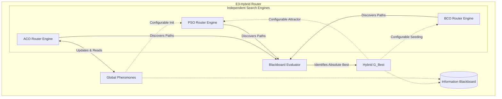

# E³-Hybrid Swarm Routing Design Document

## 1. Motivation & Justification
The **E³-Hybrid Swarm Routing Algorithm** is the primary research contribution of this thesis. Traditional standalone algorithms often suffer from severe trade-offs in highly dynamic environments (e.g., emergency zones, flash traffic):
*   **ACO** exhibits strong exploitation and long-term memory via pheromones but can suffer from stagnation and slow recovery when major arterial roads close.
*   **BCO** provides extreme local and global exploration via independent scout/recruit searches, quickly discovering detours, but lacks the persistent cross-query memory needed for steady-state efficiency.
*   **PSO** offers continuous, elegant mathematical priority optimization and rapid local convergence, but priority-encoding can become trapped in local optima without strong heuristic initialization.

The E³-Hybrid overcomes these limitations not by executing the algorithms sequentially, but by running them as a **cooperative parallel ensemble**. By isolating their search mechanisms while sharing discoveries via a centralized **Information Blackboard**, the hybrid leverages ACO for steady-state memory, BCO for rapid disruption recovery, and PSO for continuous fine-tuning. 

## 2. Architecture & Subsystem Independence
The hybrid system strictly adheres to the principle of **Composition over Inheritance**. ACO, BCO, and PSO remain 100% independent, logically separable, and individually benchmarkable routers. 

To prevent tight coupling to private implementation details, the underlying routing engines will be refactored to implement an `IterativeSwarmEngine` public interface. This exposes clean, stable search primitives:
*   `initialize_search(origin, dest, context)`
*   `execute_iteration(context) -> IterationResult`
*   `inject_global_best(path, cost)`
*   `inject_pheromone_matrix(matrix)`

The `E3HybridRouter` simply instantiates these three independent engines, orchestrates their `execute_iteration` loop, and manages the information exchange between them.

### Architecture Diagram

## 3. Information Flow & Ablation Studies
To support rigorous thesis evaluation and ablation studies, the information exchange across the Blackboard is strictly controlled via `E3HybridConfig`. Every interaction can be toggled on or off without altering the core logic:

1.  **ACO → PSO (`share_aco_to_pso: bool`)**: Particle priority vectors ($X$) are initialized and periodically pulled towards the normalized pheromone levels ($\tau$). *Purpose: Biases continuous exploration using historical discrete memory.*
2.  **Hybrid $G_{best}$ → PSO (`share_gbest_to_pso: bool`)**: PSO velocity updates use the Hybrid $G_{best}$ (which may have been discovered by ACO or BCO) as the social attractor. *Purpose: Accelerates PSO convergence towards globally discovered optima.*
3.  **Hybrid $G_{best}$ → BCO (`share_gbest_to_bco: bool`)**: BCO's recruiter bee pool is artificially seeded with the Hybrid $G_{best}$. *Purpose: Directs BCO neighborhood search around the absolute best known path.*
4.  **BCO/PSO → ACO (`share_bco_pso_to_aco: bool`)**: ACO performs its Global Pheromone Update along the Hybrid $G_{best}$, even if that route was discovered by BCO or PSO. *Purpose: Solidifies newly discovered emergency detours into the colony's long-term memory.*

## 4. Mathematical Formulation & Update Sequence

### 4.1. Iteration Sequence (Loop for $I$ iterations)
In each iteration $i$, the hybrid master loop executes:

**Phase A: Concurrent Swarm Execution**
1.  **BCO**: Calls `bco.execute_iteration()`. Scouts walk probabilistically; recruits search neighborhoods of $G_{best}$ (if seeded).
2.  **ACO**: Calls `aco.execute_iteration()`. Ants traverse graph via $p(u \to v) \propto [\tau_{u,v}]^\alpha \cdot [\eta_{u,v}]^\beta$. Ants apply local evaporation.
3.  **PSO**: Calls `pso.execute_iteration()`. Particles decode priority vectors $X_i$ via DFS and update velocities.

**Phase B: Blackboard Evaluation**
*   Extract all generated valid paths $P = P_{BCO} \cup P_{ACO} \cup P_{PSO}$.
*   Evaluate costs using the shared `MultiObjectiveEdgeScorer`.
*   Determine the iteration best ($I_{best}$). If $Cost(I_{best}) < Cost(G_{best})$, update Hybrid $G_{best}$.

**Phase C: Subsystem Synchronization (If Ablation Configs Enabled)**
*   Inject Hybrid $G_{best}$ into BCO and PSO.
*   Trigger ACO Global Pheromone Update on Hybrid $G_{best}$.
*   (Optional) Periodically inject ACO $\tau$ into PSO.

## 5. Dynamic Environment Adaptation
The Hybrid preserves learned knowledge across dynamic events (road closures, expanding emergencies) without relying on global swarm resets.
*   **Dirty State Tracking**: On `update_network()` triggers, the `E3HybridRouter` flags the environment as dirty.
*   **Lazy Re-evaluation**: Before the next search query begins, the cost of the cached Hybrid $G_{best}$ is immediately re-evaluated. If the path crosses a new closure or emergency zone, its cost inflates to $\infty$ or a high penalty.
*   **Natural Swarm Divergence**: The inflated $G_{best}$ cost instantly breaks the social attractor in PSO, invalidates the elite recruiter in BCO, and allows ACO's natural evaporation to quickly decay the obsolete pheromones. The sub-swarms organically discover new detours.

## 6. Computational Complexity
The worst-case complexity per routing query is bounded by:
$$ O\Big(I \cdot \big( (N_{ants} \cdot C_{aco}) + (N_{bees} \cdot C_{bco}) + (N_{particles} \cdot C_{pso}) \big) \Big) $$
Where $I$ is the number of iterations and $C$ is the path construction complexity of each algorithm. While computationally heavier per iteration than any standalone algorithm, the intense parallel search diversity is theorized to converge in drastically fewer iterations $I$, potentially outperforming standalone algorithms in overall execution time during complex disruption scenarios.

## 7. Assumptions & Limitations
*   **Parameter Hyper-space**: Combining three paradigms introduces a massive configuration space. It is assumed that the optimal configurations for the standalone baselines will serve as sufficient baseline parameters for the sub-engines inside the hybrid.
*   **Memory Overhead**: Maintaining continuous vectors for PSO, persistent pheromone matrices for ACO, and path caches for BCO simultaneously increases RAM footprint per vehicle.
*   **Heuristic Alignment**: The system strictly relies on the `MultiObjectiveEdgeScorer` uniformly normalizing dynamic penalties (emergencies, congestion) across all three distinct mathematical paradigms.
