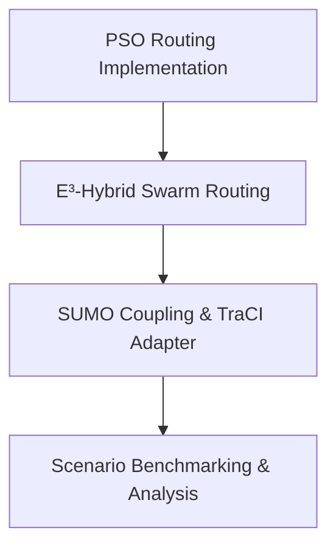

# Thesis Build Tracker: Swarm-Routing EV Simulator

This document serves as the step-by-step progress and implementation tracker for the research thesis. It outlines what has been accomplished so far, the mathematical and design rationale behind each component, how it was verified, and the detailed roadmap of next steps.

---

## 1. Thesis Context & Objectives
The goal of this thesis is to design, implement, and evaluate a swarm-intelligence-based routing framework for electric vehicles (EVs) in a dynamic, emergency-aware urban traffic network. The system evaluates and compares baseline routing algorithms (Dijkstra, A*) and swarm routing algorithms (Ant Colony System, Bee Colony Optimization, Particle Swarm Optimization) before integrating them into a unified **E³-Hybrid Swarm Routing** algorithm. The entire framework is simulator-agnostic and connects to SUMO (Simulation of Urban MObility) via TraCI for realistic traffic dynamics.

---

## 2. Completed Milestones

### Phase 1: Core Domain Models & EV Physics
*   **Objective**: Build a clean, simulator-agnostic representation of the network topology, vehicle state, and EV energy consumption.
*   **Implementation details**:
    *   **Network Graph (`src/core/network.py`)**: Models `Node` and `Edge` with dynamic states like speed reduction factors, temporary speed limits, and road closure flags (`is_closed`).
    *   **Vehicle Model (`src/core/vehicle.py`)**: Tracks position (with linear interpolation along edges), current State of Charge (SoC), recalculation count, and path history.
    *   **Battery Model (`src/core/battery.py`)**: A physics-based energy model calculating power draw based on aerodynamic drag, rolling resistance, gravity/gradient, mass, powertrain efficiency, and regenerative braking.
*   **How it was done**: Fully decoupled domain classes with configuration-driven physical constants (e.g. frontal area, mass, drag coefficients) loaded dynamically.

### Phase 2: V2X Communication Layer
*   **Objective**: Simulate realistic Vehicle-to-Vehicle (V2V) and Vehicle-to-Infrastructure (V2I) communication with regional blackout and packet loss behaviors.
*   **Implementation details**:
    *   **Typed Payloads (`src/communication/payloads.py`)**: Uses Pydantic models for routine telemetry, traffic updates, charging updates, and emergency broadcasts.
    *   **Transceivers (`src/communication/transceiver.py`)**: Operates on coordinate-based lookup callbacks to check ranges, completely decoupled from `Vehicle` internals.
    *   **Communication Channel (`src/communication/channel.py`)**: Implements multi-hop broadcasting with Time-To-Live (TTL) handling, duplicate suppression caches, latency, stochastic packet loss, and configurable regional blackout zones.

### Phase 2: Emergency System
*   **Objective**: Model dynamic hazard incidents, ambulance dispatching, emergency yielding corridors, and infrastructure failures.
*   **Implementation details**:
    *   **Incident Model (`src/emergency/incident.py`)**: Spatiotemporal hazard models with dynamic radius expansion and perpendicular edge distance projections.
    *   **Ambulance Model (`src/emergency/ambulance.py`)**: Subclass of `Vehicle` that bypasses congestion limits and periodically broadcasts high-priority emergency packets.
    *   **Emergency Corridor**: Mechanics for standard vehicles to yield (caps maximum speed) on edges traversed by ambulances.
    *   **Polymorphic Event Scheduler (`src/emergency/scheduler.py`)**: A priority-sorted execution queue handling `SimulationEvent`, `RecurringEvent`, and `RandomEvent` definitions.

### Phase 3: Routing Framework & Baselines
*   **Objective**: Provide a common routing interface and mathematically correct baseline pathfinding implementations.
*   **Implementation details**:
    *   **Base Router (`src/routing/router.py`)**: Standard interface for all pathfinding methods (`find_route`, `update_network`, `reset`, `get_statistics`).
    *   **Dijkstra & A* (`src/routing/baselines.py`)**: Standard textbook versions using priority heaps, bypassing closed edges.
    *   **A* Strategy Heuristics (`src/routing/heuristics.py`)**: Euclidean, Manhattan, and Zero heuristic calculators.
    *   **Johnson's Potential Reweighting (`src/routing/johnson.py`)**: Translates physical negative energy costs (from regenerative braking) to non-negative edge costs using node potentials, preserving mathematical correctness for Dijkstra and A*.
    *   **Route Cache (`src/routing/cache.py`)**: An edge-specific invalidation decorator caching routes and invalidating only paths that contain modified edges.
    *   **Routing Benchmark (`src/routing/benchmark.py`)**: Compares execution times, path costs, and metrics of multiple routers.

### Phase 3: Ant Colony System (ACS) Routing
*   **Objective**: Implement a research-quality ACS routing algorithm using multi-objective edge scores.
*   **Implementation details**:
    *   **Multi-Objective Edge Scorer (`src/routing/scorer.py`)**: Evaluates edges based on a weighted convex combination of travel time, distance, EV energy consumption, congestion, and emergency proximity.
    *   **ACS Router (`src/routing/aco.py`)**: Employs the pseudo-random proportional state transition rule, local pheromone updates (to encourage exploration), global pheromone updates (for the best-found path), lazy temporal evaporation, and configurable MAX-MIN pheromone bounds.
    *   **Research Metrics**: Collects iteration-by-iteration convergence, exploitation ratios, and pheromone distribution metrics.

### Phase 3: Bee Colony Optimization (BCO) Routing
*   **Objective**: Implement a BCO-based routing algorithm utilizing scout and recruit bee phases, waggle dance information sharing, and neighborhood exploration.
*   **Implementation details**:
    *   **BCO Router (`src/routing/bco.py`)**: Based on Lučić & Teodorović (2001). Features heuristic-guided random walk scouts, path prefix recruitment (neighborhood search), and a dynamic Waggle Dance computing route loyalty based on comparative costs.
    *   **Elite Route Seeding**: A configuration-driven persistence mechanism that injects the best known path from previous queries into the first iteration of the next query, allowing continuous learning across independent route requests.
    *   **Research Metrics**: Detailed evaluation of scout success rate, recruitment effectiveness, colony diversity, loyalty distribution, abandonment rate, and convergence iteration.

---

## 3. Future Roadmap: Upcoming Steps

### Step 1: Particle Swarm Optimization (PSO) Routing (Next Up)
*   **Goal**: Optimize edge-scoring weights or routing paths dynamically using PSO.
*   **Key Design Aspects**:
    *   Particles track personal best solutions (`pbest`) and the global best swarm solution (`gbest`).
    *   Dynamic adaptation of routing priorities depending on network-wide conditions.

### Step 2: E³-Hybrid Swarm Routing
*   **Goal**: Design and implement the core novelty of the thesis: a hybrid swarm routing algorithm integrating ACO, BCO, and PSO.
*   **Key Design Aspects**:
    *   Shared memory structures (shared pheromones and swarm position updates).
    *   Balancing the local search power of BCO with the global path convergence of ACO and dynamic parameter tuning of PSO.

### Step 3: SUMO Integration & TraCI Adapter
*   **Goal**: Couple the simulator with SUMO to enable real-world traffic flows, traffic lights, and realistic vehicle interactions.
*   **Key Design Aspects**:
    *   Map SUMO network elements (junctions, lanes) to core Python `Network` and `Edge` models.
    *   Sync vehicle movements, speed overrides, and coordinates between TraCI and the V2X communication module.

### Step 4: Comprehensive Scenario Benchmarking
*   **Goal**: Run evaluation scenarios comparing Dijkstra, A*, ACO, BCO, PSO, and E³-Hybrid.
*   **Key Design Aspects**:
    *   Generate statistics on average travel time, total energy consumed, charging queue delay, and emergency response times.
    *   Evaluate performance under blackout, blackout recovery, and extreme emergency incidents.

---

## 4. Verification & Testing Practices
To maintain research-grade software quality, the following checks are run before committing any feature:
1.  **Syntax Checks**: Verification that all Python code compiles without syntax errors.
2.  **Linting & Style Guidelines (`ruff`)**: Checks code complexity, unused imports, formatting, and standard PEP-8 style rules.
3.  **Static Type Inspection (`mypy`)**: Ensures type correctness, catching bugs before runtime.
4.  **Unit Tests (`pytest`)**: Runs a suite of 86 passing tests covering all system aspects (battery mechanics, broadcast TTL, incident expansion, routing reweighting, and ACS convergence).
